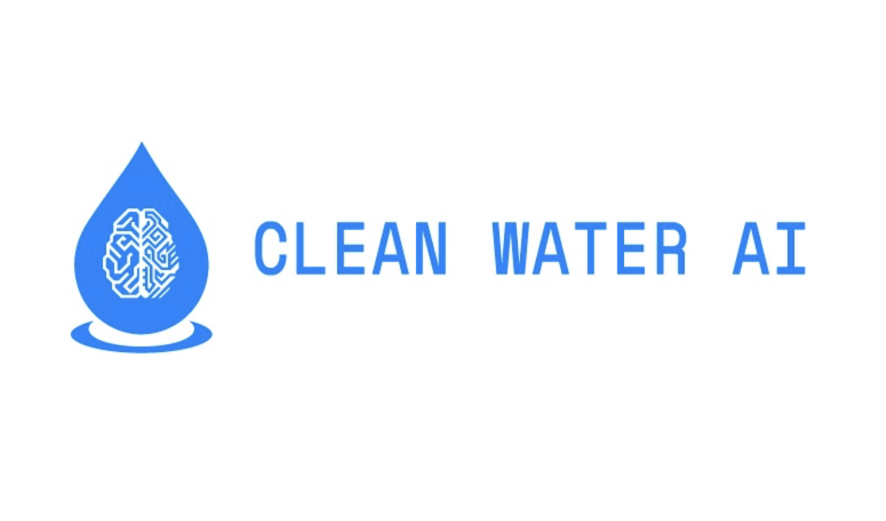

# Step by Step guide
A step by step guide is published on https://www.hackster.io/clean-water-ai/clean-water-ai-e40806

# Clean-Water-AI

According to World Health Organization, over 2.1 billion people in the world lack safe drinking water at home, more than twice as many lack safe sanitation.  And even in first world countries like Untied States, they still have water contamination problems such as Flint, Michigan.

The water quality depends essentially on the grouping of microorganisms, lead, pesticides, nitrites/nitrates, chlorine, hardness, and the water's pH. Chlorine helps in sterilizing; nitrates filtered from manures are destructive to babies; calcium and magnesium ("hardness") can cause scale development in funnels; and water with high pH levels (acidic water) can erode installations.

Traditional water quality testing usually goes through chemical reaction, which is always one time use.  To continuously monitor the water quality it becomes rather difficult.  It also adds the cost where developing countries can not afford because the chemical based strips are one time use.

Clean Water AI can be used to continuously detecting the water quality in real time, and can be used offline in areas where internet may not be accessible.  In addition, we are able to sense cholera, e-coli, and other harmful bacterias through single device rather than different test kits.  Since we are using optical and AI based solution, we can easily train more dangerous bacterias and harmful particles as needed.

Water is essential for human life.  We want to use AI to securing water quality and safety to everyone in the world, and we believe with enough help, we can change the world with his device.
